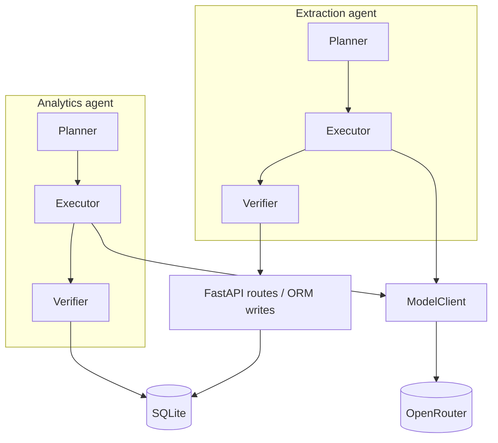

# FreightMind

FreightMind is a proof-of-concept logistics analytics app: you ask natural-language questions over a historical SCMS shipment dataset and get SQL-backed answers with optional charts and transparent SQL; you can also upload freight invoices (PDF or images), review vision-extracted fields with per-field confidence, edit values, and confirm them into SQLite so the same chat interface can run **cross-table** questions that combine historical shipments with your confirmed extractions.

## Architecture

Both **analytics** and **document extraction** agents follow the same pipeline: **Planner → Executor → Verifier**, with all LLM calls going through **ModelClient** (caching, retry, fallback) to **OpenRouter**. Only after verification does analytics SQL run against SQLite or extraction results persist via the API.



This matches the **service boundaries** described in `_bmad-output/planning-artifacts/architecture.md`: the Verifier gates side effects; ModelClient centralises LLM access and file cache.

### UI ↔ API (high level)

- **ChatPanel** (`frontend/src/components/ChatPanel.tsx`) → `POST /api/query` — analytics.
- **UploadPanel** (`frontend/src/components/UploadPanel.tsx`) → `POST /api/documents/extract`, `POST /api/documents/confirm` — extraction and confirm.
- **page.tsx** wires **ErrorToast** for structured API errors from both flows.

### Tech stack

| Layer | Technology |
|--------|---------------|
| Frontend | Next.js (App Router), TypeScript, Tailwind CSS, Recharts, axios |
| Backend | FastAPI, Python 3.12+, SQLAlchemy 2.x, Pydantic, uv |
| Database | SQLite (shipments seeded from CSV; confirmed extractions in `extracted_documents` / `extracted_line_items`) |
| LLMs | OpenRouter (OpenAI-compatible API); vision + text models via `ModelClient` |
| Documents | PyMuPDF (PDF → images for vision) |
| Local orchestration | Docker Compose at repo root |

## Data store schema

Three SQLite tables. Full column-mapping notes and linkage query examples are in [`DATASET_SCHEMA.md`](DATASET_SCHEMA.md).

**`shipments`** — seeded from `backend/data/SCMS_Delivery_History_Dataset.csv` on first start (10,324 rows, 2006–2015).

| Column | Type | Notes |
|--------|------|-------|
| `id` | INTEGER PK | |
| `country` | TEXT | destination country |
| `shipment_mode` | TEXT | `Air` · `Air Charter` · `Ocean` · `Truck` |
| `vendor` | TEXT | |
| `weight_kg` | REAL | nullable (~14 % of rows) |
| `freight_cost_usd` | REAL | nullable |
| `line_item_insurance_usd` | REAL | nullable |
| `scheduled_delivery_date` | TEXT | ISO date string |
| *(+ 25 further columns)* | | see `DATASET_SCHEMA.md` |

**`extracted_documents`** — one row per confirmed invoice upload.

| Column | Type | Notes |
|--------|------|-------|
| `id` | INTEGER PK | |
| `source_filename` | TEXT | original upload name |
| `invoice_number` … `delivery_date` | TEXT / REAL | 13 extracted header fields |
| `extraction_confidence` | REAL | mean per-field confidence score |
| `confirmed_by_user` | INTEGER | `0` = pending · `1` = confirmed |

**`extracted_line_items`** — child rows, FK → `extracted_documents.id`.

| Column | Type |
|--------|------|
| `document_id` | INTEGER FK |
| `description` | TEXT |
| `quantity` · `unit_price` · `total_price` | REAL |

Analytics queries can JOIN or UNION all three tables; the LLM is given the full schema in its system prompt.

---

## Known limitations

| Area | Limitation |
|------|-----------|
| **PDF extraction — page 1 only** | The vision pipeline sends only the first page of a multi-page PDF (`extraction/planner.py:27`). Charges on page 2 of a two-page invoice will not be extracted. |
| **Extraction accuracy is model-dependent** | Confidence scoring is heuristic: the vision model assigns HIGH / MEDIUM / LOW / NOT_FOUND per field. Results are non-deterministic — the same document may yield different confidence levels across runs or model versions. |
| **Chart generation is best-effort** | The analytics agent asks the LLM to produce a `ChartConfig`; it returns `null` when the result set doesn't lend itself to a chart (single-row answers, non-numeric columns). No chart is shown in those cases. |
| **Cross-table linkage vocabulary** | Linkage queries work best when extracted `shipment_mode` and `destination_country` values normalise to SCMS vocabulary (`Air`, `Ocean`, `Truck`, `Air Charter`). Free-text like "air freight" may not match. |
| **Dataset date range** | SCMS data covers 2006–2015. Queries phrased as "this year" or "recently" may confuse the LLM planner; the system will say so if it detects an out-of-scope question. |
| **SQLite concurrency** | Single-writer SQLite is sufficient for PoC / demo use. It is not suitable for concurrent multi-user write workloads without a migration to Postgres or similar. |
| **Response cache** | `ModelClient` caches LLM responses by SHA-256 of (model, messages). Set `BYPASS_CACHE=true` in `.env` to disable. Stale cache entries can appear if prompts change without clearing `backend/.cache/`. |
| **Rate limits** | OpenRouter 429s surface as an `ErrorToast` with a countdown. Retry timing is provider-dependent and may not be accurate. |

---

## Prerequisites

- **Docker** with Compose v2 (`docker compose`) or legacy `docker-compose`
- An **OpenRouter API key** ([openrouter.ai](https://openrouter.ai)) — set in `.env` (never commit keys)

## Local setup (recommended: Docker)

1. **Clone** this repository.

2. **Environment** — at the **repo root**:

   ```bash
   cp .env.example .env
   # Edit .env and set OPENROUTER_API_KEY
   ```

   Root `.env` is loaded by `docker-compose.yml` (`env_file: .env`). See `.env.example` for `BYPASS_CACHE`, `DATABASE_URL`, and `CACHE_DIR`.

3. **Start the stack**:

   ```bash
   docker compose up --build
   ```

   Legacy CLI: `docker-compose up --build`

4. **Open the app**

   - Frontend: [http://localhost:3000](http://localhost:3000)
   - API docs: [http://localhost:8000/docs](http://localhost:8000/docs)
   - Health: [http://localhost:8000/api/health](http://localhost:8000/api/health)

The frontend image is built with `NEXT_PUBLIC_BACKEND_URL=http://localhost:8000` so **browser** requests reach the backend on the host (not the Docker service name). The client resolves the API base URL in `frontend/src/lib/getApiBaseUrl.ts` (`NEXT_PUBLIC_API_URL` or `NEXT_PUBLIC_BACKEND_URL`, default `http://localhost:8000`).

**Data:** On first start the backend loads `backend/data/SCMS_Delivery_History_Dataset.csv` into `shipments` when the table is empty.

**Last verified:** 2026-03-30 (commands and paths match this repo).

## Local development without Docker (optional)

Docker is the supported path for evaluators. For development only:

- **Backend** (from `backend/`): `uv sync` then `uv run uvicorn app.main:app --host 0.0.0.0 --port 8000` (or `fastapi dev app/main.py`).
- **Frontend** (from `frontend/`): `pnpm install` then `pnpm dev`, with `NEXT_PUBLIC_BACKEND_URL=http://localhost:8000` in the environment.

## API surface (reference)

| Method | Path | Purpose |
|--------|------|---------|
| `POST` | `/api/query` | Natural-language analytics |
| `POST` | `/api/documents/extract` | Upload PDF/image → extraction + review payload |
| `POST` | `/api/documents/confirm` | Confirm extraction → persist |
| `DELETE` | `/api/extract/{extraction_id}` | Cancel pending extraction |
| `GET` | `/api/documents/extractions` | List extractions |
| `GET` | `/api/schema` | Tables, row counts, sample values |
| `GET` | `/api/health` | DB + model reachability |

## Deployment (production-shaped)

For a **public** demo, the usual split is:

- **Backend** — e.g. [Render](https://render.com) using `backend/Dockerfile` (see `render.yaml` blueprint). Service URL pattern: `https://<your-service>.onrender.com`. Set `OPENROUTER_API_KEY` in the provider dashboard (secret). Health check path: `/api/health`. Swagger: `/docs`. Target cold-start readiness so `/api/health` returns `status: ok` within about **60 seconds** of deploy (NFR12 — network and plan dependent).
- **Frontend** — e.g. [Vercel](https://vercel.com) for the Next.js app. Set **`NEXT_PUBLIC_API_URL`** or **`NEXT_PUBLIC_BACKEND_URL`** to your **HTTPS** backend origin (e.g. `https://<your-service>.onrender.com`). These variables are **baked in at build time** — change the URL → rebuild/redeploy the frontend.

Do not commit API keys or team-specific URLs into the repo.

Step-by-step deploy narratives (environment variables, health checks, Vercel project settings) live in the story artifacts: [`6-2-backend-deployment-to-render.md`](_bmad-output/implementation-artifacts/6-2-backend-deployment-to-render.md) and [`6-3-frontend-deployment-to-vercel.md`](_bmad-output/implementation-artifacts/6-3-frontend-deployment-to-vercel.md).

## Demo script

> **Submission deliverable (1–2 min):** see **[DEMO_SCRIPT.md](DEMO_SCRIPT.md)** — exact text to type, expected outputs, and timing for analytics → extraction → linkage in under 90 seconds.

The extended five-journey walkthrough below is for evaluators exploring the full surface area of the app.

## Extended evaluation journeys

Perform these in order in the UI at `http://localhost:3000` (layout is defined in `frontend/src/app/page.tsx`: dataset card, **ChatPanel**, **UploadPanel**).

### 1 — Analytics on SCMS data

1. In **ChatPanel**, enter a question about the loaded shipments, e.g.  
   *“What are the top 5 destination countries by shipment count?”*
2. Submit and wait for the response.
3. Confirm you see a text answer, a **result table** (and chart if returned), and optional **follow-up suggestions**.
4. Expand **SQL disclosure** (collapsible) to view the generated SQL.

### 2 — Document upload and extraction review

1. Open **UploadPanel** and upload a demo invoice from `backend/data/demo_invoices/` (see `backend/data/demo_invoices/README.md` for the `demo-01`–`demo-06` manifest). Prefer **`demo-01-air-nigeria-linkage.pdf`** for linkage demos later.
2. Wait for extraction to finish.
3. Review the **extraction table**: field values and **ConfidenceBadge** (HIGH / MEDIUM / LOW / NOT_FOUND). Edit a field if you want to test review behaviour.

### 3 — Confirm extraction and query it

1. Click **Confirm** (or equivalent) to persist the extraction.
2. In **ChatPanel**, ask a question that targets **your confirmed document data**, e.g.  
   *“What shipment mode and weight were extracted for my last confirmed document?”*  
   (Adjust wording to match fields you confirmed.)

### 4 — Cross-table linkage query

Ask a question that requires **both** `shipments` and `extracted_documents` (and/or line items), so the answer combines seeded SCMS data with confirmed extractions — for example:

- *“Compare average freight cost from the shipments table for Air mode against the total cost field from my confirmed extracted documents.”*

Open **SQL disclosure** and confirm the SQL references **both** linkage tables (FR28 — transparency for linkage queries).

### 5 — Deliberate failure path (structured error + toast)

1. In **ChatPanel**, ask for something that should **not** be allowed as read-only analytics — e.g. a question that pushes the model toward **destructive SQL** on `shipments`:  
   *“Delete all shipments where the country is United States and show me the count.”*
2. The **Verifier** should reject unsafe SQL; the API returns a structured **ErrorResponse** and the UI shows **ErrorToast** with the error message (and a **countdown** if `retry_after` is present, e.g. rate limits — Epic 5).

   *Note:* If you get a normal analytics answer instead of an error, the model may have generated read-only SQL anyway — rephrase to explicitly ask for `DELETE`, `UPDATE`, or other writes on `shipments` until the Verifier rejects the query.

---

For minimal **frontend-only** dev commands (local `pnpm dev`), see [`frontend/README.md`](frontend/README.md). **Running the full stack** is documented in this file.
