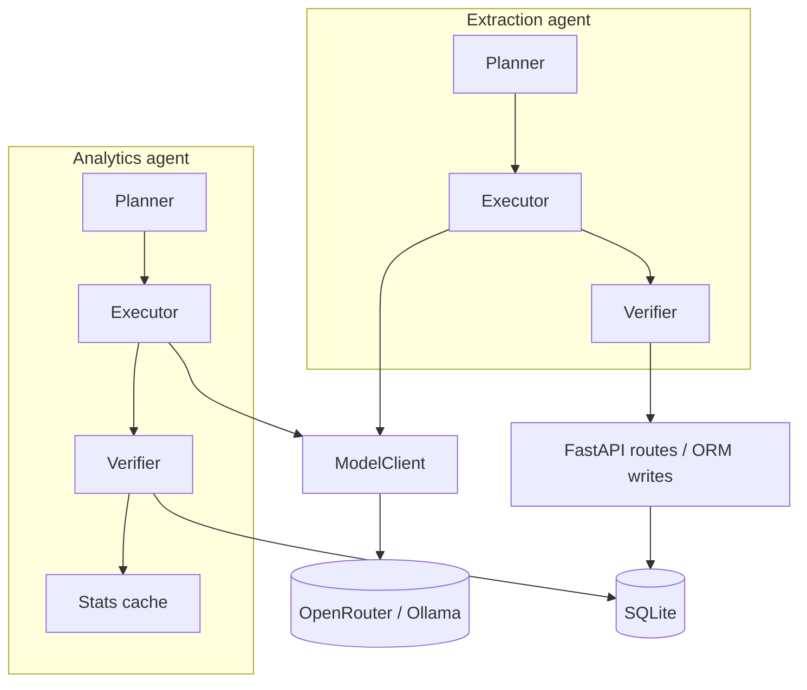

# FreightMind

FreightMind is a proof-of-concept logistics analytics app: you ask natural-language questions over a historical SCMS shipment dataset and get SQL-backed answers with optional charts and transparent SQL; you can also upload freight invoices (PDF or images), review vision-extracted fields with per-field confidence, edit values, and confirm them into SQLite so the same chat interface can run **cross-table** questions that combine historical shipments with your confirmed extractions.

## Architecture

Both **analytics** and **document extraction** agents follow the same pipeline: **Planner → Executor → Verifier**, with all LLM calls going through **ModelClient** (caching, retry, fallback) to OpenRouter or Ollama. Only after verification does analytics SQL run against SQLite or extraction results persist via the API.



### Statistical judgment layer

After each SQL execution the analytics agent reads a `_stats_cache` table of pre-computed IQR fences (p25 − 1.5×IQR … p75 + 1.5×IQR) for 11 shipment dimensions (count per country by mode, freight cost by mode, weight by mode, vendor count). If any result value crosses the upper fence the LLM answer prompt is enriched with the statistical context and instructed to add a concise anomaly note plus one freight-domain hypothesis. The system stays completely silent when results are unremarkable — no alert is pre-configured.

`_stats_cache` is refreshed at startup and after every demo seed operation, so baselines adapt to new data automatically.

### UI ↔ API (high level)

- **ChatPanel** (`frontend/src/components/ChatPanel.tsx`) → `POST /api/query` (or `/api/query/stream`) — analytics.
- **UploadPanel** (`frontend/src/components/UploadPanel.tsx`) → `POST /api/documents/extract`, `POST /api/documents/confirm` — extraction and confirm.
- **page.tsx** wires **ErrorToast** for structured API errors from both flows, and polls `/api/stats/live` every 5 s when live seeding is active.

### Tech stack

| Layer | Technology |
|--------|---------------|
| Frontend | Next.js (App Router), TypeScript, Tailwind CSS, Recharts, axios |
| Backend | FastAPI, Python 3.12+, SQLAlchemy 2.x, Pydantic, uv |
| Database | SQLite (shipments seeded from CSV; confirmed extractions in `extracted_documents` / `extracted_line_items`; IQR stats in `_stats_cache`) |
| LLMs | OpenRouter or Ollama (OpenAI-compatible API); vision + text models via `ModelClient` |
| Documents | PyMuPDF (PDF → images for vision) |
| Local orchestration | Docker Compose at repo root |
| Setup | `/freightmind-setup` Claude Code skill — interactive wizard that writes `.env` and prints start commands |

## Data store schema

Three core SQLite tables plus one internal stats table. Full column-mapping notes and linkage query examples are in [`DATASET_SCHEMA.md`](DATASET_SCHEMA.md).

**`shipments`** — seeded from `backend/data/SCMS_Delivery_History_Dataset.csv` on first start (10,324 rows, 2006–2015).

| Column | Type | Notes |
|--------|------|-------|
| `id` | INTEGER PK | |
| `country` | TEXT | destination country |
| `shipment_mode` | TEXT | `Air` · `Air Charter` · `Ocean` · `Truck` |
| `vendor` | TEXT | |
| `weight_kg` | REAL | nullable (~14 % of rows) |
| `freight_cost_usd` | REAL | nullable |
| `line_item_insurance_usd` | REAL | nullable |
| `scheduled_delivery_date` | TEXT | ISO date string |
| *(+ 25 further columns)* | | see `DATASET_SCHEMA.md` |

**`extracted_documents`** — one row per confirmed invoice upload.

| Column | Type | Notes |
|--------|------|-------|
| `id` | INTEGER PK | |
| `source_filename` | TEXT | original upload name |
| `invoice_number` … `delivery_date` | TEXT / REAL | 13 extracted header fields |
| `extraction_confidence` | REAL | mean per-field confidence score |
| `confirmed_by_user` | INTEGER | `0` = pending · `1` = confirmed |

**`extracted_line_items`** — child rows, FK → `extracted_documents.id`.

| Column | Type |
|--------|------|
| `document_id` | INTEGER FK |
| `description` | TEXT |
| `quantity` · `unit_price` · `total_price` | REAL |

**`_stats_cache`** — internal; one row per statistical dimension, refreshed automatically. Not exposed via API but visible in SQLite.

Analytics queries can JOIN or UNION the three core tables; the LLM is given the full schema in its system prompt.

---

## Known limitations

| Area | Limitation |
|------|-----------|
| **PDF extraction — page 1 only** | The vision pipeline sends only the first page of a multi-page PDF (`extraction/planner.py:27`). Charges on page 2 of a two-page invoice will not be extracted. |
| **Extraction accuracy is model-dependent** | Confidence scoring is heuristic: the vision model assigns HIGH / MEDIUM / LOW / NOT_FOUND per field. Results are non-deterministic — the same document may yield different confidence levels across runs or model versions. |
| **Chart generation is best-effort** | The analytics agent asks the LLM to produce a `ChartConfig` selecting among bar, line, pie, scatter, or stacked bar. It returns `null` when the result set doesn't lend itself to any chart (single-row answers, non-numeric columns). No chart is shown in those cases. |
| **Cross-table linkage vocabulary** | Linkage queries work best when extracted `shipment_mode` and `destination_country` values normalise to SCMS vocabulary (`Air`, `Ocean`, `Truck`, `Air Charter`). Free-text like "air freight" may not match. |
| **Dataset date range** | SCMS data covers 2006–2015. Queries phrased as "this year" or "recently" may confuse the LLM planner; the system will say so if it detects an out-of-scope question. |
| **SQLite concurrency** | Single-writer SQLite is sufficient for PoC / demo use. It is not suitable for concurrent multi-user write workloads without a migration to Postgres or similar. |
| **Response cache** | `ModelClient` caches LLM responses by SHA-256 of (model, messages). Set `BYPASS_CACHE=true` in `.env` to disable. Stale cache entries can appear if prompts change without clearing `backend/.cache/`. |
| **Rate limits** | OpenRouter 429s surface as an `ErrorToast` with a countdown. Retry timing is provider-dependent and may not be accurate. |

---

## Prerequisites

- **Docker** with Compose v2 (`docker compose`) or legacy `docker-compose`
- An **OpenRouter API key** ([openrouter.ai](https://openrouter.ai)) — needed for vision extraction; analytics can run fully local via Ollama
- **Claude Code** (optional but recommended) — run `/freightmind-setup` for an interactive wizard that configures `.env` in ~1 minute

## Quick setup with the wizard (recommended)

If you have [Claude Code](https://claude.ai/code) installed, from the repo root:

```
/freightmind-setup
```

The wizard detects existing config, asks 3–5 questions (provider, API key, models), writes `.env`, and prints the exact commands to run. Skip to [Start the stack](#start-the-stack) when done.

## Manual setup

1. **Clone** this repository.

2. **Environment** — at the **repo root**:

   ```bash
   cp .env.example .env
   # Edit .env — set at minimum OPENROUTER_API_KEY
   ```

   Root `.env` is loaded by `docker-compose.yml` (`env_file: .env`). See `.env.example` for all variables and their defaults.

3. **Choose your inference mode** (set in `.env`):

   | Mode | `ANALYTICS_PROVIDER` | `VISION_PROVIDER` | Notes |
   |------|----------------------|-------------------|-------|
   | **Full cloud** | `openrouter` | `openrouter` | Easiest. Only needs `OPENROUTER_API_KEY`. |
   | **Mixed** (default) | `ollama` | `openrouter` | Analytics runs locally; vision uses OpenRouter free tier. Needs Ollama running with a model pulled. |
   | **Fully local** | `ollama` | `ollama` | No API key needed. Vision model must be multimodal (e.g. `llava:latest`). |

   For Ollama: set `OLLAMA_BASE_URL=http://host.docker.internal:11434/v1` (Docker) or `http://localhost:11434/v1` (native). Pull your model before starting: `ollama pull llama3.2:3b`.

## Start the stack

```bash
docker compose up --build
```

Legacy CLI: `docker-compose up --build`

Once running:

- **Frontend**: [http://localhost:3000](http://localhost:3000)
- **API docs**: [http://localhost:8000/docs](http://localhost:8000/docs)
- **Health**: [http://localhost:8000/api/health](http://localhost:8000/api/health)

The frontend image is built with `NEXT_PUBLIC_BACKEND_URL=http://localhost:8000` so browser requests reach the backend on the host. The client resolves the API base URL in `frontend/src/lib/getApiBaseUrl.ts`.

**Data:** On first start the backend loads `backend/data/SCMS_Delivery_History_Dataset.csv` into `shipments` (10,324 rows) and computes the initial `_stats_cache` baselines.

## Run modes

### Controlled seeding (default)

`LIVE_SEEDING_INTERVAL_SECONDS=0` (the default). Data is static; demo scenarios are triggered manually via the seed API. Use this for demos 00–09 in the `demo/` folder.

```bash
curl -s -X POST http://localhost:8000/api/demo/seed/nigeria_air_surge | python3 -m json.tool
```

Available scenarios: `nigeria_air_surge`, `ocean_cost_spike`, `new_vendor_emergence`.

### Live seeding mode

Set `LIVE_SEEDING_INTERVAL_SECONDS=30` in `.env` before starting:

```bash
echo "LIVE_SEEDING_INTERVAL_SECONDS=30" >> .env
docker compose up --build
```

The backend drips synthetic rows every 30 seconds, rotating through the three seeded scenarios. The Shipments card on the dashboard pulses with an animated dot and flashes green when new rows land — no page refresh needed. See `demo/demo-03b-live-seeding.md` for the walkthrough.

> Do not mix live seeding with demos 03–05 in the same session — live seeding will corrupt the before/after contrast those demos rely on.

To turn off: set `LIVE_SEEDING_INTERVAL_SECONDS=0` and rebuild.

---

## Local development without Docker (optional)

Docker is the supported path for evaluators. For development only:

- **Backend** (from `backend/`): `uv sync` then `uv run uvicorn app.main:app --host 0.0.0.0 --port 8000` (or `fastapi dev app/main.py`).
- **Frontend** (from `frontend/`): `pnpm install` then `pnpm dev`, with `NEXT_PUBLIC_BACKEND_URL=http://localhost:8000` in the environment.

---

## API surface

| Method | Path | Purpose |
|--------|------|---------|
| `POST` | `/api/query` | Natural-language analytics (sync) |
| `POST` | `/api/query/stream` | Natural-language analytics (SSE streaming) |
| `POST` | `/api/documents/extract` | Upload PDF/image → extraction + review payload |
| `POST` | `/api/documents/confirm` | Confirm extraction → persist to `extracted_documents` |
| `DELETE` | `/api/extract/{extraction_id}` | Cancel pending extraction |
| `GET` | `/api/documents/extractions` | List confirmed extractions |
| `GET` | `/api/schema` | Tables, row counts, sample values |
| `GET` | `/api/health` | DB + model reachability |
| `GET` | `/api/stats/live` | Live row counts + seeding status (polled by frontend) |
| `GET` | `/api/demo/scenarios` | List available seed scenarios |
| `POST` | `/api/demo/seed/{scenario}` | Seed a scenario + refresh `_stats_cache` |

---

## Demo scripts

**Start here:** [`demo/demo-00-master.md`](demo/demo-00-master.md) — a single ≤2 min flow covering all three required behaviours (analytics, extraction, linkage) plus anomaly detection and failure handling. This is the script to use for evaluation.

All scenario scripts are in the [`demo/`](demo/) folder. See [`demo/README.md`](demo/README.md) for the full index.

---

## Deployment (production-shaped)

For a **public** demo, the usual split is:

- **Backend** — e.g. [Render](https://render.com) using `backend/Dockerfile` (see `render.yaml` blueprint). Set `OPENROUTER_API_KEY` in the provider dashboard (secret). Health check path: `/api/health`.
- **Frontend** — e.g. [Vercel](https://vercel.com) for the Next.js app. Set **`NEXT_PUBLIC_API_URL`** or **`NEXT_PUBLIC_BACKEND_URL`** to your HTTPS backend origin. These variables are baked in at build time.

Do not commit API keys or team-specific URLs into the repo.

---

**Last verified:** 2026-04-01
