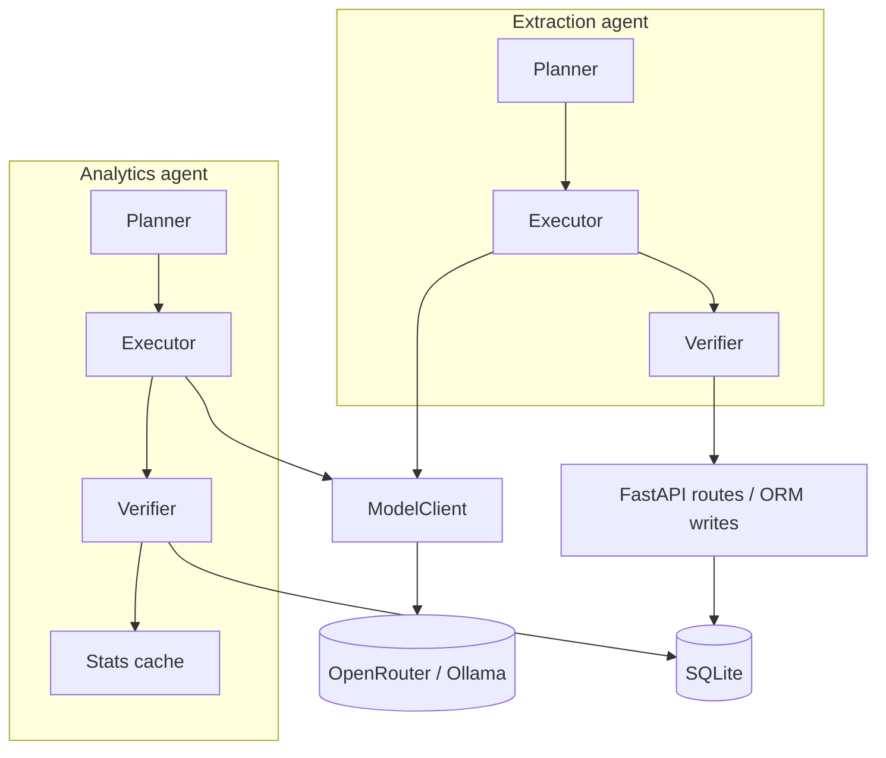

# FreightMind

FreightMind is a proof-of-concept logistics analytics app: you ask natural-language questions over a historical SCMS shipment dataset and get SQL-backed answers with optional charts and transparent SQL; you can also upload freight invoices (PDF or images), review vision-extracted fields with per-field confidence, edit values, and confirm them into SQLite so the same chat interface can run **cross-table** questions that combine historical shipments with your confirmed extractions.

## Development methodology — BMAD

FreightMind was built using the **[BMAD framework](https://github.com/bmad-framework/bmad)** (Brains, Methods, Agents, Decisions) — a spec-driven development approach where every layer of the system is fully specified before a line of code is written. The process runs through a structured agent sequence:

**Product Brief → PRD → Architecture → Epics & Stories → Implementation → Review**

Each stage produces an artifact that the next stage builds on. Claude Code skills (`/bmad-agent-pm`, `/bmad-agent-architect`, `/bmad-agent-dev`, etc.) drive each stage interactively, maintaining full traceability from business requirement to deployed code.

The full artifact trail for this project lives in `_bmad-output/`:

| Artifact | Path |
|----------|------|
| Product brief | `_bmad-output/planning-artifacts/product-brief.md` |
| PRD | `_bmad-output/planning-artifacts/prd.md` |
| Architecture | `_bmad-output/planning-artifacts/architecture.md` |
| Epics | `_bmad-output/planning-artifacts/epics.md` |
| Implementation readiness report | `_bmad-output/planning-artifacts/implementation-readiness-report-2026-03-30.md` |
| Story-level implementation specs | `_bmad-output/implementation-artifacts/` (one file per story) |

Every feature in the codebase — from `ModelClient` caching to the Verifier's read-only SQL guard to the per-field confidence scoring — was driven by a story spec in `_bmad-output/implementation-artifacts/` before it was implemented. The statistical judgment layer and synthetic seeder were added through a dedicated brainstorming session (`_bmad-output/brainstorming/`) that applied first-principles and cross-pollination techniques to identify the highest-leverage engineering additions.

---

## Architecture

Both **analytics** and **document extraction** agents follow the same pipeline: **Planner → Executor → Verifier**, with all LLM calls going through **ModelClient** (caching, retry, fallback) to OpenRouter or Ollama. Only after verification does analytics SQL run against SQLite or extraction results persist via the API.



### Statistical judgment layer, self-calibrating baselines, and living data

Three capabilities were built on top of the core Planner → Executor → Verifier pipeline to demonstrate engineering depth beyond the baseline requirements. They form a virtuous cycle: the seeder adds plausible data → the baselines self-calibrate → the judgment layer has a statistically grounded foundation → responses become more meaningful.

#### 1. Internal statistical foundation (`_stats_cache`)

At startup the backend computes IQR-based statistics across **11 shipment dimensions** — shipment count per country by mode (Air / Ocean / Truck / all), freight cost by mode, weight by mode, and vendor shipment count — and stores them in a `_stats_cache` SQLite table. Each row holds `mean`, `stddev`, `p25`, `p75`, `iqr_fence_low`, and `iqr_fence_high` for its dimension.

This is the agent's internal statistical dashboard: a live, queryable view of the distribution of every key metric across the entire dataset, always current, never stale because it is refreshed after every seed operation.

| Dimension group | Count |
|-----------------|-------|
| Shipment count per country (all / Air / Ocean / Truck) | 4 |
| Freight cost USD (all / Air / Ocean / Truck) | 4 |
| Weight kg (all / Air) | 2 |
| Shipment count per vendor | 1 |

The IQR method (`p25 − 1.5×IQR` … `p75 + 1.5×IQR`) is used rather than z-scores because it is robust to outliers and adapts to any distribution shape without manual tuning.

#### 2. Statistical judgment layer (anomaly detection)

After each SQL execution, `detect_anomaly()` in `backend/app/services/stats_service.py` inspects the query and result set:

1. **Dimension inference** — regex heuristics on the SQL (mode filter, GROUP BY country/vendor) and column names (freight/cost, weight, count) map the query to one of the 11 cached dimensions.
2. **Fence check** — the maximum numeric value in the result is compared to `iqr_fence_high` for that dimension.
3. **Selective voice** — if the value is within the fence the system stays completely silent. No alert, no annotation. Only genuine statistical outliers surface.
4. **Enriched prompt** — when the fence is crossed, the LLM answer prompt is augmented with the observed value, typical IQR range, upper boundary, and ratio to the historical mean. The model is instructed to add **one concise anomaly note and one freight-domain hypothesis** (e.g. modal dependency, port congestion, supply chain pressure) — and explicitly not to add a follow-up question, since those are surfaced separately as suggestion chips.

The result: the analytics agent holds an opinion about its own data and can distinguish a routine Nigeria Air count from a statistically anomalous one, without any pre-configured alert rules.

#### 3. Synthetic data seeder (living dataset)

Three pre-scripted seed scenarios insert plausible rows into the `shipments` table, designed to cross specific IQR fences after injection. Each uses a fixed random seed (`random.Random(42)`) for reproducibility.

| Scenario | Rows | Target dimension | Effect |
|----------|------|-----------------|--------|
| `nigeria_air_surge` | 42 Air rows to Nigeria, 80–600 kg, $6k–$22k | `count_per_country_air` | Nigeria count crosses the Air IQR fence (~565) |
| `ocean_cost_spike` | 35 Ocean rows, $24k–$48k | `freight_cost_usd_ocean` | Ocean average crosses the freight cost fence (~$28,875) |
| `new_vendor_emergence` | 25 rows from "FreightCo International" | `count_per_vendor_all` | New vendor enters the top of the vendor landscape |

Seeded rows use delivery dates in 2025–2026, making them distinguishable from the SCMS baseline (2006–2015) and fully queryable via the chat interface. After each seed the `_stats_cache` is refreshed so the judgment layer immediately operates on the updated distribution.

In **live seeding mode** (`LIVE_SEEDING_INTERVAL_SECONDS > 0`) the backend runs an asyncio background task that rotates through scenarios automatically. The frontend polls `/api/stats/live` every 5 seconds and flashes the affected dashboard card when new rows land — anomalies surface without any manual intervention.

### UI ↔ API (high level)

- **ChatPanel** (`frontend/src/components/ChatPanel.tsx`) → `POST /api/query` (or `/api/query/stream`) — analytics.
- **UploadPanel** (`frontend/src/components/UploadPanel.tsx`) → `POST /api/documents/extract`, `POST /api/documents/confirm` — extraction and confirm.
- **page.tsx** wires **ErrorToast** for structured API errors from both flows, and polls `/api/stats/live` every 5 s when live seeding is active.

### Tech stack

| Layer | Technology |
|--------|---------------|
| Frontend | Next.js (App Router), TypeScript, Tailwind CSS, Recharts, axios |
| Backend | FastAPI, Python 3.12+, SQLAlchemy 2.x, Pydantic, uv |
| Database | SQLite (shipments seeded from CSV; confirmed extractions in `extracted_documents` / `extracted_line_items`; IQR stats in `_stats_cache`) |
| LLMs | OpenRouter or Ollama (OpenAI-compatible API); vision + text models via `ModelClient` |
| Documents | PyMuPDF (PDF → images for vision) |
| Local orchestration | Docker Compose at repo root |
| Setup | `/freightmind-setup` Claude Code skill — interactive wizard that writes `.env` and prints start commands |

## Data store schema

Three core SQLite tables plus one internal stats table. Full column-mapping notes and linkage query examples are in [`DATASET_SCHEMA.md`](DATASET_SCHEMA.md).

**`shipments`** — seeded from `backend/data/SCMS_Delivery_History_Dataset.csv` on first start (10,324 rows, 2006–2015).

| Column | Type | Notes |
|--------|------|-------|
| `id` | INTEGER PK | |
| `country` | TEXT | destination country |
| `shipment_mode` | TEXT | `Air` · `Air Charter` · `Ocean` · `Truck` |
| `vendor` | TEXT | |
| `weight_kg` | REAL | nullable (~14 % of rows) |
| `freight_cost_usd` | REAL | nullable |
| `line_item_insurance_usd` | REAL | nullable |
| `scheduled_delivery_date` | TEXT | ISO date string |
| *(+ 25 further columns)* | | see `DATASET_SCHEMA.md` |

**`extracted_documents`** — one row per confirmed invoice upload.

| Column | Type | Notes |
|--------|------|-------|
| `id` | INTEGER PK | |
| `source_filename` | TEXT | original upload name |
| `invoice_number` … `delivery_date` | TEXT / REAL | 13 extracted header fields |
| `extraction_confidence` | REAL | mean per-field confidence score |
| `confirmed_by_user` | INTEGER | `0` = pending · `1` = confirmed |

**`extracted_line_items`** — child rows, FK → `extracted_documents.id`.

| Column | Type |
|--------|------|
| `document_id` | INTEGER FK |
| `description` | TEXT |
| `quantity` · `unit_price` · `total_price` | REAL |

**`_stats_cache`** — internal; one row per statistical dimension, refreshed automatically. Not exposed via API but visible in SQLite.

Analytics queries can JOIN or UNION the three core tables; the LLM is given the full schema in its system prompt.

---

## Known limitations

| Area | Limitation |
|------|-----------|
| **PDF extraction — page 1 only** | The vision pipeline sends only the first page of a multi-page PDF (`extraction/planner.py:27`). Charges on page 2 of a two-page invoice will not be extracted. |
| **Extraction accuracy is model-dependent** | Confidence scoring is heuristic: the vision model assigns HIGH / MEDIUM / LOW / NOT_FOUND per field. Results are non-deterministic — the same document may yield different confidence levels across runs or model versions. |
| **Chart generation is best-effort** | The analytics agent asks the LLM to produce a `ChartConfig` selecting among bar, line, pie, scatter, or stacked bar. It returns `null` when the result set doesn't lend itself to any chart (single-row answers, non-numeric columns). No chart is shown in those cases. |
| **Cross-table linkage vocabulary** | Linkage queries work best when extracted `shipment_mode` and `destination_country` values normalise to SCMS vocabulary (`Air`, `Ocean`, `Truck`, `Air Charter`). Free-text like "air freight" may not match. |
| **Dataset date range** | SCMS data covers 2006–2015. Queries phrased as "this year" or "recently" may confuse the LLM planner; the system will say so if it detects an out-of-scope question. |
| **SQLite concurrency** | Single-writer SQLite is sufficient for PoC / demo use. It is not suitable for concurrent multi-user write workloads without a migration to Postgres or similar. |
| **Response cache** | `ModelClient` caches LLM responses by SHA-256 of (model, messages). Set `BYPASS_CACHE=true` in `.env` to disable. Stale cache entries can appear if prompts change without clearing `backend/.cache/`. |
| **Rate limits** | OpenRouter 429s surface as an `ErrorToast` with a countdown. Retry timing is provider-dependent and may not be accurate. |

---

## Pipeline scalability — future direction

Each analytics query currently traverses the full **Planner → Executor → Verifier** pipeline, generating up to six sequential LLM calls (SQL plan, SQL execution, verification, chart config, answer synthesis, follow-up suggestions). For a PoC this is acceptable; at production scale it is expensive and slow. The right long-term approach is a tiered query pipeline that short-circuits the generation steps wherever possible.

### Current cost model

| Step | LLM call | Skippable? |
|------|----------|------------|
| Planner: NL → SQL plan | yes | with warm cache |
| Executor: plan → SQL | yes | with warm cache |
| Verifier: validate SQL | yes | with warm cache |
| Chart config | yes | with warm cache |
| Answer synthesis | yes | with warm cache |
| Follow-up suggestions | yes | with warm cache |

The existing `ModelClient` SHA-256 cache already handles exact-match queries — identical question string, same model → cached response at zero cost. The gap is **semantic equivalents**: "top 5 countries by Air shipments" and "top 5 destinations for Air mode" hash differently but should resolve to the same SQL.

### Proposed tiered architecture

```
Incoming NL question
        │
        ▼
[Tier 1]  Exact hash cache              ← already implemented (ModelClient)
          SHA-256(model + messages) → cached response
        │ miss
        ▼
[Tier 2]  Aggregate classifier          ← partially implemented (_stats_cache)
          Recognises aggregate-pattern questions (mean, count, distribution)
          and routes directly to _stats_cache lookup — no LLM call at all.
          Covers a large share of real-world analytics questions.
        │ miss
        ▼
[Tier 3]  Semantic SQL cache            ← not yet implemented
          Embed incoming question (small embedding model, ~$0.00002/call).
          Search vector store of (question_embedding, validated_sql) pairs.
          If cosine similarity > 0.92: adapt cached SQL via parameter
          substitution (LIMIT, mode filter, country filter) and skip
          generation entirely. Store every new validated SQL for future hits.
        │ miss or low confidence
        ▼
[Tier 4]  Few-shot augmented generation ← not yet implemented
          Retrieve top-3 semantically similar (question, sql) pairs from the
          vector store and inject them into the Planner prompt as examples.
          Does not reduce LLM calls but improves first-pass SQL quality,
          reducing Verifier rejections and pipeline retries.
        │
        ▼
[Tier 5]  Full pipeline (current behaviour)
          Planner → Executor → Verifier → Answer → Follow-ups
          Result stored in Tier 3 cache for future retrieval.
```

Tiers 1 and 2 are effectively free. Tier 3 trades one cheap embedding call for five expensive generation calls — at scale this is the highest-leverage optimisation. Tier 4 improves quality without adding cost at the pipeline level.

### Why the RAG analogy is approximately correct

Tiers 3 and 4 together are a form of **retrieval-augmented SQL generation**: past validated queries act as the knowledge base, incoming questions are the retrieval query, and the retrieved SQL (or examples) augment generation. The key difference from text RAG is that retrieved SQL cannot be included verbatim — it requires parameter adaptation (swapping filters, aggregations, LIMIT values) before it is safe to execute. This adaptation is the engineering challenge: for simple template-shaped queries it can be done with AST-level parameter substitution; for complex cross-table joins it may require a lightweight LLM rewrite pass.

### `_stats_cache` as Tier 2 seed

The statistical foundation already built (`_stats_cache`, 11 dimensions) is the seed of a Tier 2 classifier. A significant fraction of natural-language analytics questions resolve to an aggregate over one of those 11 dimensions. Routing these to a direct table lookup rather than SQL generation would eliminate the most common class of LLM calls before any semantic search is needed.

---

## Prerequisites

- **Docker** with Compose v2 (`docker compose`) or legacy `docker-compose`
- An **OpenRouter API key** ([openrouter.ai](https://openrouter.ai)) — needed for vision extraction; analytics can run fully local via Ollama
- **Claude Code** (optional but recommended) — run `/freightmind-setup` for an interactive wizard that configures `.env` in ~1 minute

## Quick setup with the wizard (recommended)

If you have [Claude Code](https://claude.ai/code) installed, from the repo root:

```
/freightmind-setup
```

The wizard detects existing config, asks 3–5 questions (provider, API key, models), writes `.env`, and prints the exact commands to run. Skip to [Start the stack](#start-the-stack) when done.

## Manual setup

1. **Clone** this repository.

2. **Environment** — at the **repo root**:

   ```bash
   cp .env.example .env
   # Edit .env — set at minimum OPENROUTER_API_KEY
   ```

   Root `.env` is loaded by `docker-compose.yml` (`env_file: .env`). See `.env.example` for all variables and their defaults.

3. **Choose your inference mode** (set in `.env`):

   | Mode | `ANALYTICS_PROVIDER` | `VISION_PROVIDER` | Notes |
   |------|----------------------|-------------------|-------|
   | **Full cloud** | `openrouter` | `openrouter` | Easiest. Only needs `OPENROUTER_API_KEY`. |
   | **Mixed** (default) | `ollama` | `openrouter` | Analytics runs locally; vision uses OpenRouter free tier. Needs Ollama running with a model pulled. |
   | **Fully local** | `ollama` | `ollama` | No API key needed. Vision model must be multimodal (e.g. `llava:latest`). |

   For Ollama: set `OLLAMA_BASE_URL=http://host.docker.internal:11434/v1` (Docker) or `http://localhost:11434/v1` (native). Pull your model before starting: `ollama pull llama3.2:3b`.

## Start the stack

```bash
docker compose up --build
```

Legacy CLI: `docker-compose up --build`

Once running:

- **Frontend**: [http://localhost:3000](http://localhost:3000)
- **API docs**: [http://localhost:8000/docs](http://localhost:8000/docs)
- **Health**: [http://localhost:8000/api/health](http://localhost:8000/api/health)

The frontend image is built with `NEXT_PUBLIC_BACKEND_URL=http://localhost:8000` so browser requests reach the backend on the host. The client resolves the API base URL in `frontend/src/lib/getApiBaseUrl.ts`.

**Data:** On first start the backend loads `backend/data/SCMS_Delivery_History_Dataset.csv` into `shipments` (10,324 rows) and computes the initial `_stats_cache` baselines.

## Run modes

### Controlled seeding (default)

`LIVE_SEEDING_INTERVAL_SECONDS=0` (the default). Data is static; demo scenarios are triggered manually via the seed API. Use this for demos 00–09 in the `demo/` folder.

```bash
curl -s -X POST http://localhost:8000/api/demo/seed/nigeria_air_surge | python3 -m json.tool
```

Available scenarios: `nigeria_air_surge`, `ocean_cost_spike`, `new_vendor_emergence`.

### Live seeding mode

Set `LIVE_SEEDING_INTERVAL_SECONDS=30` in `.env` before starting:

```bash
echo "LIVE_SEEDING_INTERVAL_SECONDS=30" >> .env
docker compose up --build
```

The backend drips synthetic rows every 30 seconds, rotating through the three seeded scenarios. The Shipments card on the dashboard pulses with an animated dot and flashes green when new rows land — no page refresh needed. See `demo/demo-03b-live-seeding.md` for the walkthrough.

> Do not mix live seeding with demos 03–05 in the same session — live seeding will corrupt the before/after contrast those demos rely on.

To turn off: set `LIVE_SEEDING_INTERVAL_SECONDS=0` and rebuild.

---

## Local development without Docker (optional)

Docker is the supported path for evaluators. For development only:

- **Backend** (from `backend/`): `uv sync` then `uv run uvicorn app.main:app --host 0.0.0.0 --port 8000` (or `fastapi dev app/main.py`).
- **Frontend** (from `frontend/`): `pnpm install` then `pnpm dev`, with `NEXT_PUBLIC_BACKEND_URL=http://localhost:8000` in the environment.

---

## API surface

| Method | Path | Purpose |
|--------|------|---------|
| `POST` | `/api/query` | Natural-language analytics (sync) |
| `POST` | `/api/query/stream` | Natural-language analytics (SSE streaming) |
| `POST` | `/api/documents/extract` | Upload PDF/image → extraction + review payload |
| `POST` | `/api/documents/confirm` | Confirm extraction → persist to `extracted_documents` |
| `DELETE` | `/api/extract/{extraction_id}` | Cancel pending extraction |
| `GET` | `/api/documents/extractions` | List confirmed extractions |
| `GET` | `/api/schema` | Tables, row counts, sample values |
| `GET` | `/api/health` | DB + model reachability |
| `GET` | `/api/stats/live` | Live row counts + seeding status (polled by frontend) |
| `GET` | `/api/demo/scenarios` | List available seed scenarios |
| `POST` | `/api/demo/seed/{scenario}` | Seed a scenario + refresh `_stats_cache` |

---

## Demo scripts

**Start here:** [`demo/demo-00-master.md`](demo/demo-00-master.md) — a single ≤2 min flow covering all three required behaviours (analytics, extraction, linkage) plus anomaly detection and failure handling. This is the script to use for evaluation.

All scenario scripts are in the [`demo/`](demo/) folder. See [`demo/README.md`](demo/README.md) for the full index.

---

## Deployment (production-shaped)

For a **public** demo, the usual split is:

- **Backend** — e.g. [Render](https://render.com) using `backend/Dockerfile` (see `render.yaml` blueprint). Set `OPENROUTER_API_KEY` in the provider dashboard (secret). Health check path: `/api/health`.
- **Frontend** — e.g. [Vercel](https://vercel.com) for the Next.js app. Set **`NEXT_PUBLIC_API_URL`** or **`NEXT_PUBLIC_BACKEND_URL`** to your HTTPS backend origin. These variables are baked in at build time.

Do not commit API keys or team-specific URLs into the repo.

---

**Last verified:** 2026-04-01
