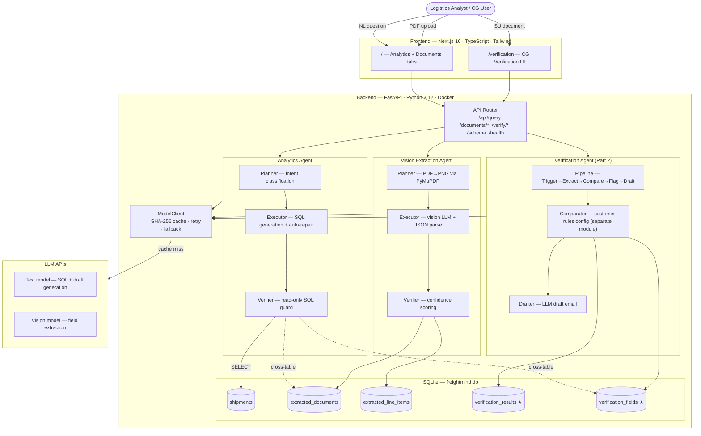
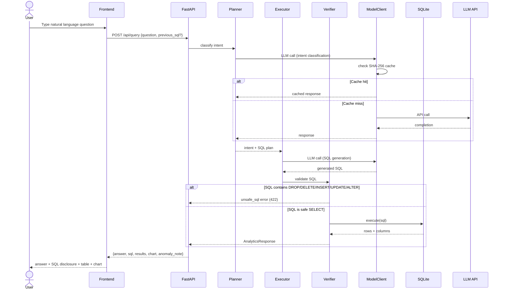
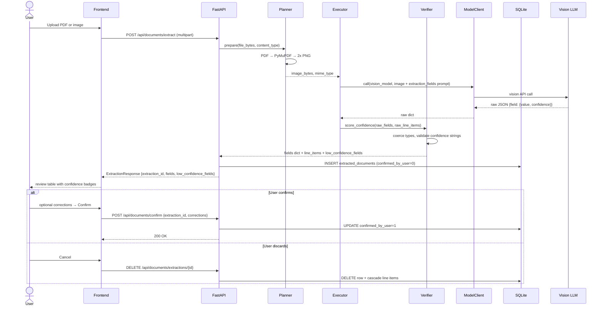
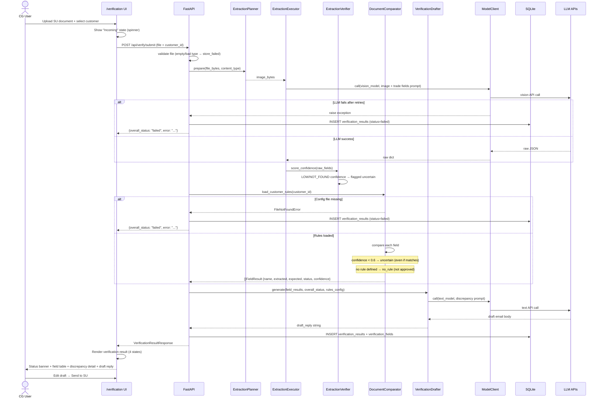

# FreightMind — Architecture Diagrams

Four diagrams: system overview, analytics pipeline, extraction pipeline, and the Part 2 verification pipeline.

---

## 1. System Architecture

★ = Part 2 tables

---

## 2. Analytics Agent Pipeline

---

## 3. Vision Extraction Pipeline

---

## 4. Verification Pipeline (Part 2)

