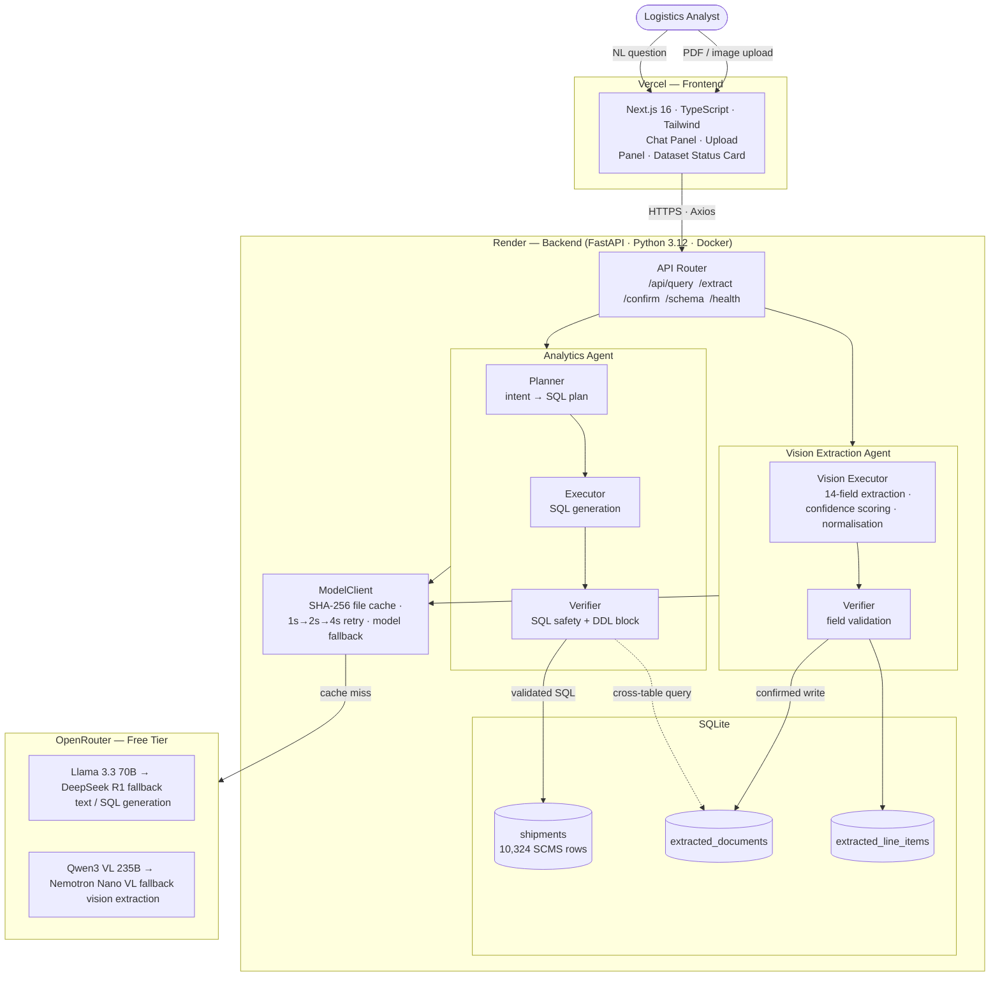
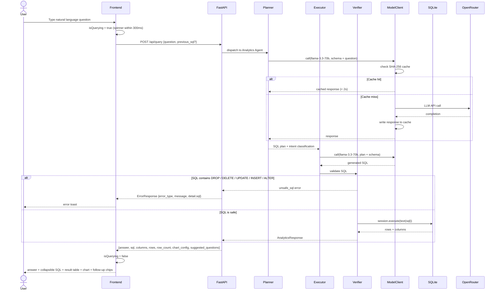
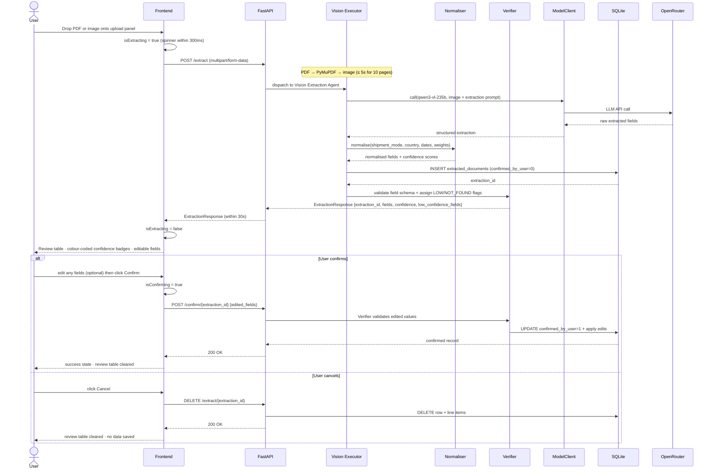

# FreightMind — Architecture Diagrams

Three diagrams covering the full system: a high-level architecture overview, and step-by-step pipeline sequences for both agents.

---

## 1. System Architecture

---

## 2. Analytics Agent Pipeline

---

## 3. Vision Extraction Pipeline

